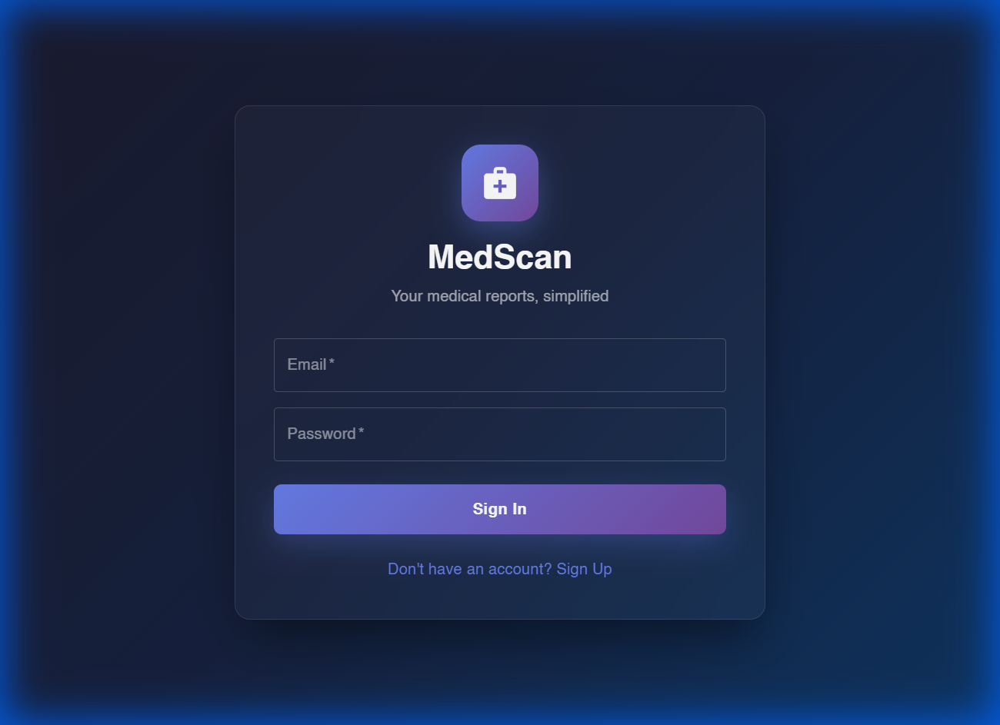
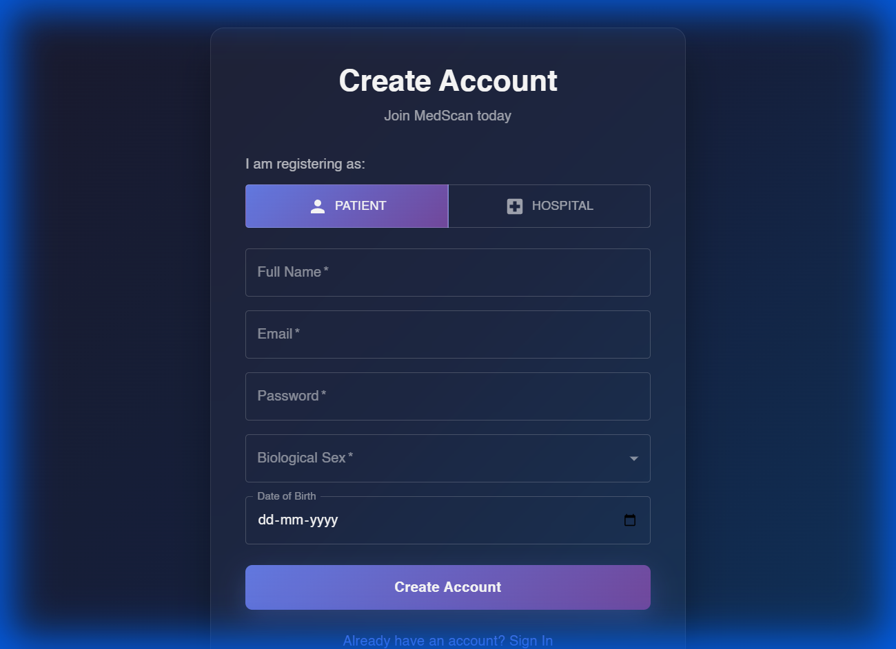

# MedScan 🏥

**Your medical reports, simplified.**

MedScan is an AI-powered platform that simplifies complex medical reports, making them easy to understand for patients and healthcare providers.

## ✨ Features

- 🔐 **Secure Authentication** - Patient and Hospital user roles with JWT-based auth
- 📄 **Report Upload** - Upload medical reports (PDF) for AI analysis
- 🤖 **AI-Powered Analysis** - Multi-agent system for comprehensive report insights
- 📊 **Personalized Dashboard** - View and manage your medical history

## 📸 Screenshots

### Login Page


### Registration Page


## 🛠️ Tech Stack

**Frontend:**
- React 18 + Vite
- Material-UI (MUI)
- Redux Toolkit
- React Router

**Backend:**
- FastAPI (Python)
- MongoDB + Beanie ODM
- JWT Authentication
- LangChain + OpenAI

## 🚀 Getting Started

### Prerequisites

- Python 3.11+
- Node.js 18+
- MongoDB (local or Atlas)

### Backend Setup

```bash
# Navigate to backend
cd backend

# Create virtual environment
python -m venv .venv

# Activate virtual environment
# Windows:
.\.venv\Scripts\activate
# Linux/Mac:
source .venv/bin/activate

# Install dependencies
pip install -r requirements.txt

# Create .env file with your configuration
cp .env.example .env
# Edit .env with your MongoDB URI and OpenAI API key

# Run the server
uvicorn app.main:app --reload --host 0.0.0.0 --port 8000
```

### Frontend Setup

```bash
# Navigate to frontend
cd frontend

# Install dependencies
npm install

# Run development server
npm run dev
```

### Environment Variables

Create a `.env` file in the `backend` directory:

```env
MONGODB_URI=mongodb://localhost:27017/medscan
SECRET_KEY=your-secret-key-here
OPENAI_API_KEY=your-openai-api-key
```

## 📁 Project Structure

```
MedScan/
├── backend/
│   ├── app/
│   │   ├── core/          # Config, security, database
│   │   ├── models/        # Pydantic/Beanie models
│   │   ├── routers/       # API routes
│   │   └── services/      # Business logic
│   └── requirements.txt
├── frontend/
│   ├── src/
│   │   ├── pages/         # React pages
│   │   ├── store/         # Redux store
│   │   ├── services/      # API services
│   │   └── theme.js       # MUI theme
│   └── package.json
└── README.md
```

## 🔗 API Endpoints

| Method | Endpoint | Description |
|--------|----------|-------------|
| POST | `/auth/register` | Register new user |
| POST | `/auth/login` | Login user |
| GET | `/auth/me` | Get current user |
| POST | `/reports/upload` | Upload medical report |
| GET | `/reports/` | Get user's reports |

## 📝 License

MIT License

## 👨‍💻 Author

**Akarsh Ghildyal**

---

Made with ❤️ for better healthcare understanding
