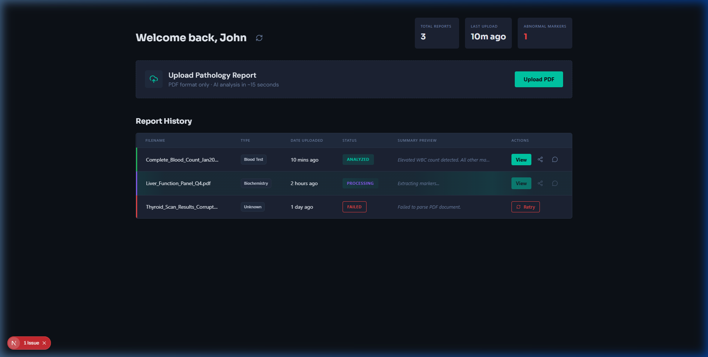
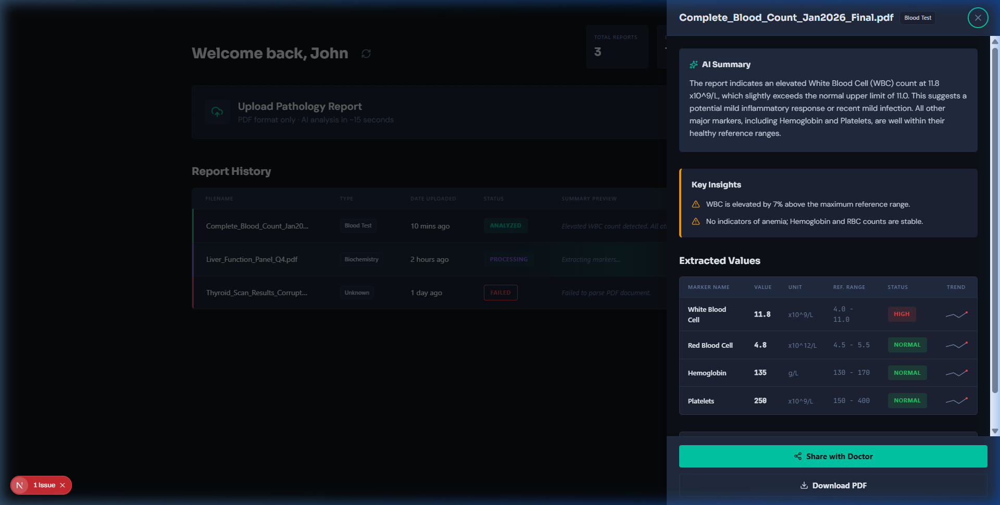
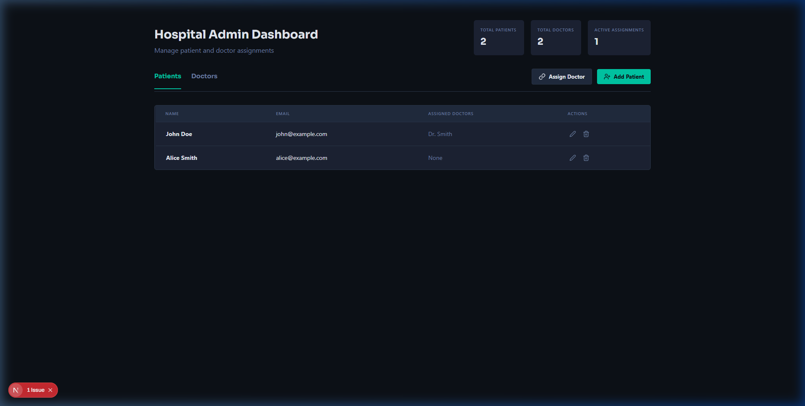
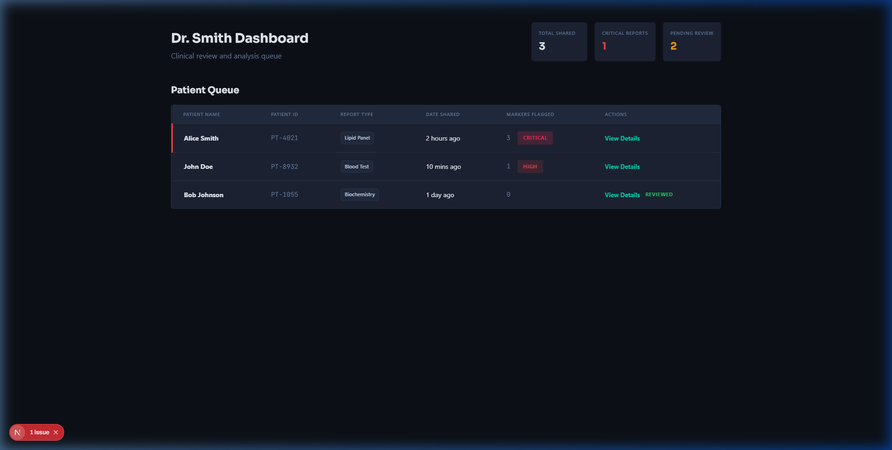

<div align="center">
  
  <h1>🏥 MedScan</h1>
  <p><b>Your pathology reports, understood.</b></p>
  <p>An autonomous, multi-agent AI platform built to simplify, analyze, and track complex medical biomarker data for patients and healthcare providers.</p>
</div>

---

## 🎯 The Motivation (Bridging the Gap)

Medical diagnostic reports are designed for healthcare professionals and are notoriously difficult for patients to interpret. Patients frequently encounter confusing medical terminology, numerical values, and reference ranges. As a result, they often rely on internet searches that can produce incorrect and anxiety-inducing interpretations, while doctors spend significant clinical time explaining basic report details. 

**MedScan gap-fills this problem** by acting as an intelligent translation layer. It translates complex diagnostic reports into understandable, accurate insights for patients, while preserving the clinical integrity of the medical information for doctors.

## ✨ Features

- **Precision Clinical Design** — A custom, bespoke dark-mode interface built on Next.js 15+ App Router, Radix UI primitives, and Tailwind CSS.
- **Multimodal AI Agents** — A complex FastAPI background pipeline utilizing LangChain to parse raw PDFs, extract specific biomarkers, and generate conversational clinical overviews.
- **Role-Based Portals** — Specialized, interconnected dashboards for:
  - **Patients**: Upload reports, view historical trends via Recharts, interact with the AI Chatbot, and securely share data.
  - **Doctors**: Manage an assigned queue of patient reports, view flagged CRITICAL biomarkers, and digitally "Mark as Reviewed".
  - **Hospital Admins**: Provision and assign doctors to patient pools via a structured management interface.
  - **Developers**: Real-time pipeline execution viewer with raw JSON extraction logs.
- **Secure Architecture** — JWT-based authentication layered over Beanie ODM (MongoDB) with strict route protection.

## 📸 Interface

| Patient Dashboard | Report Analysis Drawer |
|:---:|:---:|
|  |  |
| **Admin Controls** | **Doctor Queue** |
|  |  |

## 🛠️ Technology Stack

**Frontend (Next.js 15+ App Router)**
- Framework: React 19 + Next.js
- Styling: Tailwind CSS v4 + native CSS variables
- UI Behaviors: Radix UI Primitives, Lucide Icons
- Data Vis: Recharts
- Fonts: Sora (Headings), DM Sans (Body), JetBrains Mono (Data)

**Backend (FastAPI)**
- Framework: FastAPI (Python 3.11+)
- Database: MongoDB + Beanie ODM
- Background Tasks: Native FastAPI background execution + Celery patterns
- AI Core: LangChain, LLM APIs
- Security: Passlib (bcrypt), JWT tokens

## 🚀 Getting Started

### Prerequisites
- Python 3.11+
- Node.js 18+
- MongoDB (local or Atlas)

### 1. Backend Setup

```bash
cd backend
python -m venv .venv

# Activate virtual environment
# Windows:
.\.venv\Scripts\activate
# Linux/Mac:
source .venv/bin/activate

pip install -r requirements.txt

# Create .env and configure MongoDB URI & LLM API keys
cp .env.example .env

# Run development server
uvicorn app.main:app --reload --host 0.0.0.0 --port 8000
```

### 2. Frontend Setup

```bash
cd frontend
npm install

# Start Turbopack dev server
npm run dev
```
Navigate to `http://localhost:3000` to view the application.

## 📁 Project Structure

```text
MedScan/
├── backend/
│   ├── app/
│   │   ├── core/          # Config, Security, JWT logic
│   │   ├── models/        # Beanie ODM models (User, Report, ReportShare)
│   │   ├── routers/       # Endpoints (auth, admin, doctor, reports, trends)
│   │   └── services/      # LangChain agents (Extraction, Analysis, Summary)
│   └── main.py
├── frontend/
│   ├── src/
│   │   ├── app/           # Next.js App Router (login, patient, doctor, admin, dev)
│   │   ├── components/    # Reusable UI (StatusBadge, MetricChip, DataTable)
│   │   └── lib/           # Utility functions (cn merger, formatters)
│   ├── globals.css        # Precision Clinical design system variables
│   └── middleware.ts      # Route protection validation
├── screens/               # Visual UI documentation
└── README.md
```

## 👨‍💻 Author

**Akarsh Ghildyal**

---
<div align="center">
  <i>Engineered for better healthcare understanding</i>
</div>
