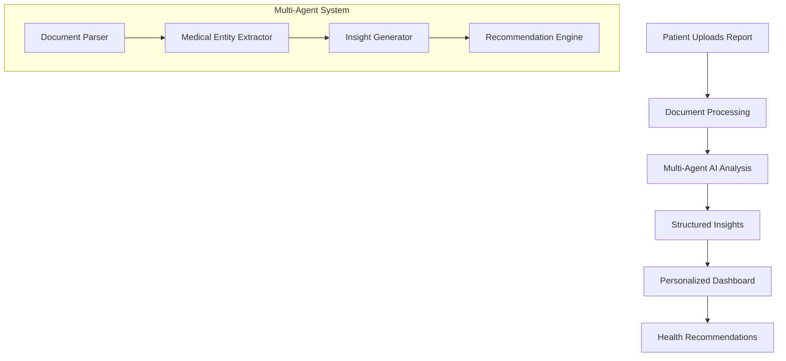

# MedScan Action Plan 📋

> **Last Updated:** February 7, 2026  
> **Project Status:** Active Development

---

## 🎯 Project Vision

MedScan is an AI-powered platform that transforms complex medical reports into easy-to-understand insights for patients and healthcare providers. The platform uses a multi-agent AI architecture to analyze medical documents and provide personalized health recommendations.

### Expected Outcome



**Core User Journey:**
1. **Authentication** — Patients and hospitals can securely sign up and log in
2. **Document Upload** — Patients upload medical reports (PDF, images)
3. **AI Processing** — Multi-agent system analyzes and extracts insights
4. **Dashboard View** — Users see simplified, actionable health information
5. **History & Trends** — Track health metrics over time

---

## ✅ Implemented Features

### Phase 1: Foundation ✔️

| Feature | Status | Files |
|---------|--------|-------|
| **Backend Setup** | ✅ Complete | `backend/app/main.py`, `backend/app/core/` |
| **MongoDB Integration** | ✅ Complete | `backend/app/db.py`, Beanie ODM |
| **FastAPI Configuration** | ✅ Complete | CORS, health check, API versioning |

### Phase 2: Authentication ✔️

| Feature | Status | Files |
|---------|--------|-------|
| **User Model** | ✅ Complete | `backend/app/models/user.py` |
| **JWT Authentication** | ✅ Complete | `backend/app/core/security.py` |
| **Registration API** | ✅ Complete | `POST /api/v1/auth/register` |
| **Login API** | ✅ Complete | `POST /api/v1/auth/login` |
| **Get Current User** | ✅ Complete | `GET /api/v1/auth/me` |
| **List Patients (Hospital)** | ✅ Complete | `GET /api/v1/auth/patients` |

**User Roles:**
- `hospital` — Can view all patients, manage reports
- `patient` — Can upload and view own reports

### Phase 3: Frontend Foundation ✔️

| Feature | Status | Files |
|---------|--------|-------|
| **React + Vite Setup** | ✅ Complete | `frontend/` |
| **Material-UI Theme** | ✅ Complete | `frontend/src/theme.js` |
| **Redux Store** | ✅ Complete | `frontend/src/store/` |
| **API Service** | ✅ Complete | `frontend/src/services/api.js` |
| **Login Page** | ✅ Complete | `frontend/src/pages/Login.jsx` |
| **Registration Page** | ✅ Complete | `frontend/src/pages/Register.jsx` |
| **Protected Routes** | ✅ Complete | `frontend/src/App.jsx` |

### Phase 4: Dashboards ✔️

| Feature | Status | Files |
|---------|--------|-------|
| **Patient Dashboard** | ✅ Complete | `frontend/src/pages/PatientDashboard.jsx` |
| **Hospital Dashboard** | ✅ Complete | `frontend/src/pages/HospitalDashboard.jsx` |
| **Bento Grid Layout** | ✅ Complete | Glassmorphism design |
| **Patient List (Hospital)** | ✅ Complete | Table with status chips |

### Phase 5: File Upload (UI Only) ✔️

| Feature | Status | Files |
|---------|--------|-------|
| **FileUpload Component** | ✅ Complete | `frontend/src/components/FileUpload.jsx` |
| **Drag & Drop** | ✅ Complete | Visual feedback on hover |
| **File Validation** | ✅ Complete | PDF, JPG, PNG (max 10MB) |
| **Progress Animation** | ✅ Complete | Simulated upload progress |
| **Success State** | ✅ Complete | Animated confirmation |

### Phase 6: LLM Infrastructure ✔️

| Feature | Status | Files |
|---------|--------|-------|
| **OpenRouter Config** | ✅ Complete | `backend/app/core/config.py`, `.env` |
| **LLM Client** | ✅ Complete | `backend/app/services/llm/llm_client.py` |
| **Base Agent Class** | ✅ Complete | `backend/app/services/agents/base_agent.py` |
| **Document Analyzer** | ✅ Complete | `backend/app/services/agents/document_analyzer.py` |
| **Report Model** | ✅ Complete | `backend/app/models/report.py` |

**Models Configured:**
- `google/gemini-2.0-flash-exp:free` — Vision & reasoning
- `meta-llama/llama-3.1-8b-instruct:free` — Fast structured output

### Phase 7: Upload API & Pipeline ✔️

| Feature | Status | Files |
|---------|--------|-------|
| **Upload Endpoint** | ✅ Complete | `backend/app/routers/reports.py` |
| **Background Analysis** | ✅ Complete | Document Analyzer runs async |
| **Initial Screener** | ✅ Complete | `backend/app/services/agents/initial_screener.py` |
| **Report Model** | ✅ Complete | `backend/app/models/report.py` |
| **Frontend Integration** | ✅ Complete | Real API calls from FileUpload |

**API Endpoints:**
- `POST /api/v1/reports/upload` — Upload file, triggers analysis
- `GET /api/v1/reports/` — List user's reports
- `GET /api/v1/reports/{id}` — Get report summary
- `GET /api/v1/reports/{id}/details` — Get full report details

### Phase 8: Dashboard Metrics & Agent Completion ✔️

| Feature | Status | Files |
|---------|--------|-------|
| **In-Depth Analyzer** | ✅ Complete | `backend/app/services/agents/in_depth_analyzer.py` |
| **Summary Creator** | ✅ Complete | `backend/app/services/agents/summary_creator.py` |
| **Comparison Creator** | ✅ Complete | `backend/app/services/agents/comparison_creator.py` |
| **Metric Model** | ✅ Complete | `Metric`, `MetricStatus` in `report.py` |
| **Compare Endpoint** | ✅ Complete | `GET /api/v1/reports/compare/` |
| **Dashboard Summary API** | ✅ Complete | `GET /api/v1/reports/dashboard/summary` |
| **Health Overview UI** | ✅ Complete | Flagged/Normal counts in dashboard |
| **Flagged Metrics Panel** | ✅ Complete | Table with status badges |
| **Compare Modal** | ✅ Complete | Side-by-side report comparison |

**Full Analysis Pipeline:**
```
Upload → Document Analyzer → Initial Screener → In-Depth Analyzer → Summary Creator
```

---

## 🔮 Remaining Features (To Be Built)

### Phase 9: Ask Away — RAG-Based Q&A

**Goal:** Allow users to ask questions about their reports in natural language.

| Feature | Priority | Description |
|---------|----------|-------------|
| **Text Indexing** | High | Store report text with MongoDB text indexes |
| **Ask Away Agent** | High | Process user questions, retrieve context |
| **Chat API** | High | `POST /api/v1/chat/ask` endpoint |
| **Chat UI** | High | Chat interface in dashboard |
| **Conversation History** | Medium | Store past Q&A for context |

**Backend Implementation:**
```python
# backend/app/services/agents/ask_away.py
class AskAwayAgent(BaseAgent):
    """RAG-based Q&A agent for report queries."""
    
    async def process(self, input_data):
        # 1. Retrieve relevant report sections using text search
        # 2. Build context from extracted_text and metrics
        # 3. Generate answer using LLM with context
        # 4. Return answer with source references
```

**Required Files:**
- `backend/app/services/agents/ask_away.py` — Agent implementation
- `backend/app/routers/chat.py` — Chat API endpoints
- `backend/app/models/chat.py` — ChatMessage model
- `frontend/src/components/ChatInterface.jsx` — Chat UI component

---

### Phase 10: Report Formatter — PDF Export

**Goal:** Generate downloadable PDF reports with analysis results.

| Feature | Priority | Description |
|---------|----------|-------------|
| **PDF Template** | High | Design clean report layout |
| **Report Generator** | High | Generate PDF from analysis data |
| **Download API** | High | `GET /api/v1/reports/{id}/export` |
| **Download Button** | Medium | Add to report details view |
| **Email Report** | Low | Optional email delivery |

**Backend Implementation:**
```python
# Using reportlab or weasyprint
from reportlab.lib.pagesizes import letter
from reportlab.platypus import SimpleDocTemplate, Paragraph, Table

async def generate_pdf_report(report: Report) -> bytes:
    # 1. Create PDF document
    # 2. Add header with patient info
    # 3. Add health summary section
    # 4. Add flagged metrics table
    # 5. Add recommendations
    # 6. Return PDF bytes
```

**Required Files:**
- `backend/app/services/pdf_generator.py` — PDF generation logic
- `backend/app/routers/reports.py` — Add export endpoint
- New dependency: `reportlab` or `weasyprint`

---

### Phase 11: Health Trends — Historical Tracking

**Goal:** Track and visualize health metrics over time.

| Feature | Priority | Description |
|---------|----------|-------------|
| **Metric History API** | High | `GET /api/v1/metrics/history?name=...` |
| **Trend Calculation** | High | Calculate improvement/decline |
| **Charts Component** | High | Line charts for metric trends |
| **Trend Summary** | Medium | AI-generated trend insights |
| **Alerts** | Medium | Notify on significant changes |

**Frontend Implementation:**
```jsx
// Using recharts or chart.js
import { LineChart, Line, XAxis, YAxis, Tooltip } from 'recharts';

function MetricTrendChart({ metricName, data }) {
    return (
        <LineChart data={data}>
            <XAxis dataKey="date" />
            <YAxis />
            <Tooltip />
            <Line type="monotone" dataKey="value" stroke="#667eea" />
        </LineChart>
    );
}
```

**Required Files:**
- `backend/app/routers/metrics.py` — Metrics history API
- `frontend/src/components/TrendChart.jsx` — Chart component
- `frontend/src/pages/HealthTrends.jsx` — Trends page
- New dependency (frontend): `recharts`

---

### Phase 12: Production & Polish

**Goal:** Prepare application for production deployment.

| Feature | Priority | Description |
|---------|----------|-------------|
| **Error Handling** | High | Global error boundaries, API error responses |
| **Loading States** | High | Skeleton loaders, spinners |
| **Input Validation** | High | Form validation, sanitization |
| **Rate Limiting** | High | Protect API from abuse |
| **Logging** | High | Structured logging with correlation IDs |
| **Health Checks** | Medium | `/health` and `/ready` endpoints |
| **Docker Setup** | Medium | Dockerfile, docker-compose |
| **CI/CD** | Medium | GitHub Actions for testing/deployment |
| **SSL/HTTPS** | High | Certificate configuration |
| **Environment Config** | High | Separate dev/staging/prod configs |

**Security Checklist:**
- [ ] HTTPS everywhere
- [ ] Secure cookie settings
- [ ] CORS properly configured
- [ ] Rate limiting enabled
- [ ] Input sanitization
- [ ] SQL/NoSQL injection prevention
- [ ] XSS protection
- [ ] CSRF tokens (if needed)

**Deployment Options:**
1. **Docker + AWS/GCP** — Containerized deployment
2. **Vercel (Frontend) + Railway (Backend)** — Managed platforms
3. **DigitalOcean App Platform** — Simple PaaS option

---

## 📊 Progress Summary

| Phase | Name | Status |
|-------|------|--------|
| 1 | Foundation | ✅ Complete |
| 2 | Authentication | ✅ Complete |
| 3 | Frontend Foundation | ✅ Complete |
| 4 | Dashboards | ✅ Complete |
| 5 | File Upload | ✅ Complete |
| 6 | LLM Infrastructure | ✅ Complete |
| 7 | Upload API & Pipeline | ✅ Complete |
| 8 | Dashboard Metrics | ✅ Complete |
| 9 | Ask Away (RAG Q&A) | ⏳ To Do |
| 10 | Report Formatter | ⏳ To Do |
| 11 | Health Trends | ⏳ To Do |
| 12 | Production & Polish | ⏳ To Do |

**Estimated Completion:** ~70% of core features done

---

## 🛠️ Development Workflow

> **MANDATORY STEPS** — Follow this process for every new feature.

### Step 1: Check Action Plan
```
Before starting ANY new feature:
1. Read actionplan.md thoroughly
2. Identify if a similar feature exists
3. Understand dependencies
```

### Step 2: Clarify Requirements
```
Ask clarifying questions if:
- The feature overlaps with existing code
- There are multiple implementation approaches
- The scope is unclear
- UI/UX decisions are needed
```

### Step 3: Implement Feature
```
During implementation:
1. Follow existing code patterns
2. Maintain consistent styling (glassmorphism theme)
3. Write clean, documented code
4. Create reusable components when applicable
```

### Step 4: Test Thoroughly
```
Testing checklist:
□ Feature works as expected
□ Edge cases handled
□ Error states display correctly
□ No console errors
□ Responsive on different screen sizes
□ Integration with existing features works
```

> ⚠️ **DO NOT proceed to the next feature until testing passes!**

### Step 5: Update Action Plan
```
After successful testing:
1. Mark the feature as complete in this document
2. Add new files to the feature table
3. Update the "Last Updated" date
4. Document any important notes
```

---

## 🛠️ Tech Stack Reference

| Layer | Technology |
|-------|------------|
| **Frontend** | React 18, Vite, Material-UI, Redux Toolkit |
| **Backend** | FastAPI, Python 3.11+, Beanie ODM |
| **Database** | MongoDB |
| **Auth** | JWT (python-jose) |
| **AI** | LangChain, OpenAI (planned) |
| **Styling** | Glassmorphism, dark theme, gradients |

---

## 📁 Project Structure

```
MedScan/
├── backend/
│   ├── app/
│   │   ├── core/           # Config, security, database
│   │   │   ├── config.py   # Environment settings
│   │   │   └── security.py # JWT, password hashing
│   │   ├── models/         # Pydantic/Beanie models
│   │   │   ├── user.py     # User model & schemas
│   │   │   └── medical.py  # Medical report models
│   │   ├── routers/        # API routes
│   │   │   └── auth.py     # Authentication endpoints
│   │   ├── services/       # Business logic
│   │   ├── db.py           # Database initialization
│   │   └── main.py         # FastAPI app entry
│   ├── requirements.txt
│   └── .env
├── frontend/
│   ├── src/
│   │   ├── components/     # Reusable UI components
│   │   │   └── FileUpload.jsx
│   │   ├── pages/          # Route pages
│   │   │   ├── Login.jsx
│   │   │   ├── Register.jsx
│   │   │   ├── PatientDashboard.jsx
│   │   │   └── HospitalDashboard.jsx
│   │   ├── store/          # Redux state management
│   │   │   ├── index.js
│   │   │   └── authSlice.js
│   │   ├── services/       # API client
│   │   │   └── api.js
│   │   ├── App.jsx         # Main app with routing
│   │   ├── main.jsx        # Entry point
│   │   └── theme.js        # MUI theme config
│   └── package.json
├── docs/
│   └── screenshots/
├── actionplan.md           # This file
└── README.md
```

---

## 📝 Notes & Decisions

| Date | Decision | Rationale |
|------|----------|-----------|
| 2026-02-07 | File upload is UI-only initially | Allows rapid frontend iteration before backend integration |
| 2026-02-07 | Using simulated upload progress | Real progress will come with backend integration |
| - | Bento grid layout for dashboards | Modern, visually appealing design that works well with cards |
| - | Glassmorphism styling | Premium feel with transparency and blur effects |

---

## 🚀 Quick Commands

```bash
# Backend
cd backend
uvicorn app.main:app --reload --port 8000

# Frontend
cd frontend
npm run dev

# MongoDB (if local)
mongod --dbpath /path/to/data
```

---

*This document is the single source of truth for MedScan development progress.*
