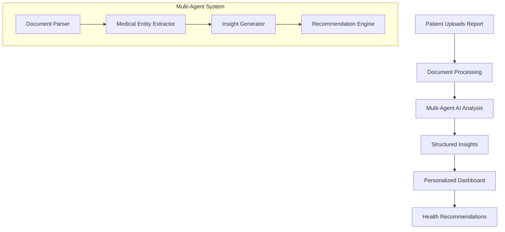

# MedScan Action Plan 📋

> **Last Updated:** February 7, 2026  
> **Project Status:** Active Development

---

## 🎯 Project Vision

MedScan is an AI-powered platform that transforms complex medical reports into easy-to-understand insights for patients and healthcare providers. The platform uses a multi-agent AI architecture to analyze medical documents and provide personalized health recommendations.

### Expected Outcome



**Core User Journey:**
1. **Authentication** — Patients and hospitals can securely sign up and log in
2. **Document Upload** — Patients upload medical reports (PDF, images)
3. **AI Processing** — Multi-agent system analyzes and extracts insights
4. **Dashboard View** — Users see simplified, actionable health information
5. **History & Trends** — Track health metrics over time

---

## ✅ Implemented Features

### Phase 1: Foundation ✔️

| Feature | Status | Files |
|---------|--------|-------|
| **Backend Setup** | ✅ Complete | `backend/app/main.py`, `backend/app/core/` |
| **MongoDB Integration** | ✅ Complete | `backend/app/db.py`, Beanie ODM |
| **FastAPI Configuration** | ✅ Complete | CORS, health check, API versioning |

### Phase 2: Authentication ✔️

| Feature | Status | Files |
|---------|--------|-------|
| **User Model** | ✅ Complete | `backend/app/models/user.py` |
| **JWT Authentication** | ✅ Complete | `backend/app/core/security.py` |
| **Registration API** | ✅ Complete | `POST /api/v1/auth/register` |
| **Login API** | ✅ Complete | `POST /api/v1/auth/login` |
| **Get Current User** | ✅ Complete | `GET /api/v1/auth/me` |
| **List Patients (Hospital)** | ✅ Complete | `GET /api/v1/auth/patients` |

**User Roles:**
- `hospital` — Can view all patients, manage reports
- `patient` — Can upload and view own reports

### Phase 3: Frontend Foundation ✔️

| Feature | Status | Files |
|---------|--------|-------|
| **React + Vite Setup** | ✅ Complete | `frontend/` |
| **Material-UI Theme** | ✅ Complete | `frontend/src/theme.js` |
| **Redux Store** | ✅ Complete | `frontend/src/store/` |
| **API Service** | ✅ Complete | `frontend/src/services/api.js` |
| **Login Page** | ✅ Complete | `frontend/src/pages/Login.jsx` |
| **Registration Page** | ✅ Complete | `frontend/src/pages/Register.jsx` |
| **Protected Routes** | ✅ Complete | `frontend/src/App.jsx` |

### Phase 4: Dashboards ✔️

| Feature | Status | Files |
|---------|--------|-------|
| **Patient Dashboard** | ✅ Complete | `frontend/src/pages/PatientDashboard.jsx` |
| **Hospital Dashboard** | ✅ Complete | `frontend/src/pages/HospitalDashboard.jsx` |
| **Bento Grid Layout** | ✅ Complete | Glassmorphism design |
| **Patient List (Hospital)** | ✅ Complete | Table with status chips |

### Phase 5: File Upload (UI Only) ✔️

| Feature | Status | Files |
|---------|--------|-------|
| **FileUpload Component** | ✅ Complete | `frontend/src/components/FileUpload.jsx` |
| **Drag & Drop** | ✅ Complete | Visual feedback on hover |
| **File Validation** | ✅ Complete | PDF, JPG, PNG (max 10MB) |
| **Progress Animation** | ✅ Complete | Simulated upload progress |
| **Success State** | ✅ Complete | Animated confirmation |

### Phase 6: LLM Infrastructure ✔️

| Feature | Status | Files |
|---------|--------|-------|
| **OpenRouter Config** | ✅ Complete | `backend/app/core/config.py`, `.env` |
| **LLM Client** | ✅ Complete | `backend/app/services/llm/llm_client.py` |
| **Base Agent Class** | ✅ Complete | `backend/app/services/agents/base_agent.py` |
| **Document Analyzer** | ✅ Complete | `backend/app/services/agents/document_analyzer.py` |
| **Report Model** | ✅ Complete | `backend/app/models/report.py` |

**Models Configured:**
- `google/gemini-2.0-flash-exp:free` — Vision & reasoning
- `meta-llama/llama-3.1-8b-instruct:free` — Fast structured output

### Phase 7: Upload API & Pipeline ✔️

| Feature | Status | Files |
|---------|--------|-------|
| **Upload Endpoint** | ✅ Complete | `backend/app/routers/reports.py` |
| **Background Analysis** | ✅ Complete | Document Analyzer runs async |
| **Initial Screener** | ✅ Complete | `backend/app/services/agents/initial_screener.py` |
| **Report Model** | ✅ Complete | `backend/app/models/report.py` |
| **Frontend Integration** | ✅ Complete | Real API calls from FileUpload |

**API Endpoints:**
- `POST /api/v1/reports/upload` — Upload file, triggers analysis
- `GET /api/v1/reports/` — List user's reports
- `GET /api/v1/reports/{id}` — Get report summary
- `GET /api/v1/reports/{id}/details` — Get full report details

---

##  Development Workflow

> **MANDATORY STEPS** — Follow this process for every new feature.

### Step 1: Check Action Plan
```
Before starting ANY new feature:
1. Read actionplan.md thoroughly
2. Identify if a similar feature exists
3. Understand dependencies
```

### Step 2: Clarify Requirements
```
Ask clarifying questions if:
- The feature overlaps with existing code
- There are multiple implementation approaches
- The scope is unclear
- UI/UX decisions are needed
```

### Step 3: Implement Feature
```
During implementation:
1. Follow existing code patterns
2. Maintain consistent styling (glassmorphism theme)
3. Write clean, documented code
4. Create reusable components when applicable
```

### Step 4: Test Thoroughly
```
Testing checklist:
□ Feature works as expected
□ Edge cases handled
□ Error states display correctly
□ No console errors
□ Responsive on different screen sizes
□ Integration with existing features works
```

> ⚠️ **DO NOT proceed to the next feature until testing passes!**

### Step 5: Update Action Plan
```
After successful testing:
1. Mark the feature as complete in this document
2. Add new files to the feature table
3. Update the "Last Updated" date
4. Document any important notes
```

---

## 🛠️ Tech Stack Reference

| Layer | Technology |
|-------|------------|
| **Frontend** | React 18, Vite, Material-UI, Redux Toolkit |
| **Backend** | FastAPI, Python 3.11+, Beanie ODM |
| **Database** | MongoDB |
| **Auth** | JWT (python-jose) |
| **AI** | LangChain, OpenAI (planned) |
| **Styling** | Glassmorphism, dark theme, gradients |

---

## 📁 Project Structure

```
MedScan/
├── backend/
│   ├── app/
│   │   ├── core/           # Config, security, database
│   │   │   ├── config.py   # Environment settings
│   │   │   └── security.py # JWT, password hashing
│   │   ├── models/         # Pydantic/Beanie models
│   │   │   ├── user.py     # User model & schemas
│   │   │   └── medical.py  # Medical report models
│   │   ├── routers/        # API routes
│   │   │   └── auth.py     # Authentication endpoints
│   │   ├── services/       # Business logic
│   │   ├── db.py           # Database initialization
│   │   └── main.py         # FastAPI app entry
│   ├── requirements.txt
│   └── .env
├── frontend/
│   ├── src/
│   │   ├── components/     # Reusable UI components
│   │   │   └── FileUpload.jsx
│   │   ├── pages/          # Route pages
│   │   │   ├── Login.jsx
│   │   │   ├── Register.jsx
│   │   │   ├── PatientDashboard.jsx
│   │   │   └── HospitalDashboard.jsx
│   │   ├── store/          # Redux state management
│   │   │   ├── index.js
│   │   │   └── authSlice.js
│   │   ├── services/       # API client
│   │   │   └── api.js
│   │   ├── App.jsx         # Main app with routing
│   │   ├── main.jsx        # Entry point
│   │   └── theme.js        # MUI theme config
│   └── package.json
├── docs/
│   └── screenshots/
├── actionplan.md           # This file
└── README.md
```

---

## 📝 Notes & Decisions

| Date | Decision | Rationale |
|------|----------|-----------|
| 2026-02-07 | File upload is UI-only initially | Allows rapid frontend iteration before backend integration |
| 2026-02-07 | Using simulated upload progress | Real progress will come with backend integration |
| - | Bento grid layout for dashboards | Modern, visually appealing design that works well with cards |
| - | Glassmorphism styling | Premium feel with transparency and blur effects |

---

## 🚀 Quick Commands

```bash
# Backend
cd backend
uvicorn app.main:app --reload --port 8000

# Frontend
cd frontend
npm run dev

# MongoDB (if local)
mongod --dbpath /path/to/data
```

---

*This document is the single source of truth for MedScan development progress.*
