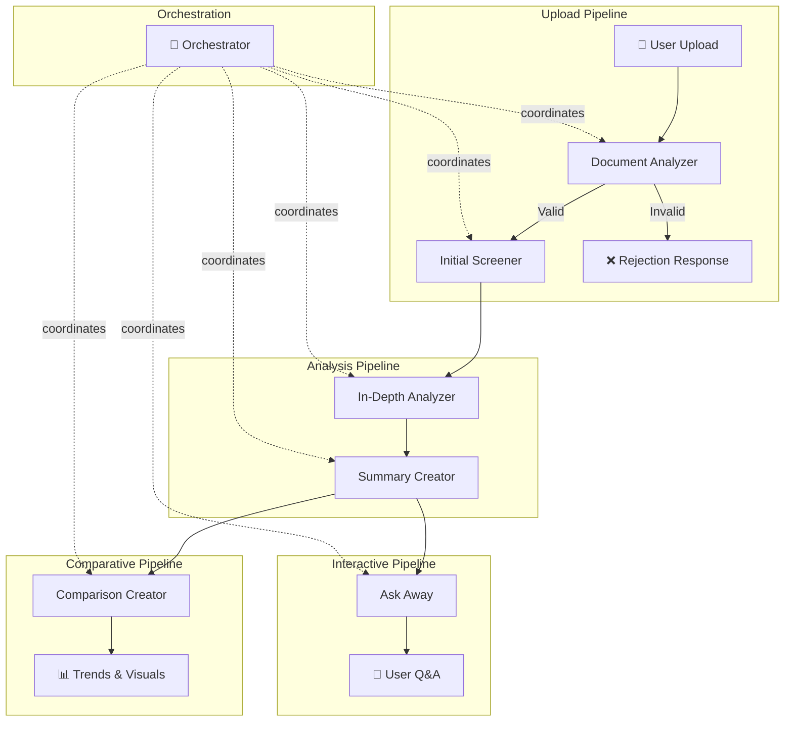

# MedScan Multi-Agent Architecture 🤖

> **Version:** 1.0 (Draft)  
> **Last Updated:** February 8, 2026

---

## Overview

MedScan uses a multi-agent system to process medical documents and provide actionable insights. Each agent has a specific responsibility, creating a robust pipeline that transforms raw medical reports into understandable health information.



---

## Agent Registry

| # | Agent Name | Type | Trigger | Output |
|---|------------|------|---------|--------|
| 0 | **Orchestrator** | Coordinator | Any request | Routes to appropriate agent |
| 1 | **Document Analyzer** | Processor | File upload | Parsed text + validation |
| 2 | **Initial Screener** | Analyzer | Valid document | Structured summary JSON |
| 3 | **In-Depth Analyzer** | Analyzer | Screener output | Insights + correlations |
| 4 | **Summary Creator** | Generator | Any analysis | Readable summary (agents + users) |
| 5 | **Comparison Creator** | Analyzer | Multiple reports | Trends + changes |
| 6 | **Ask Away** | Interactive | User query | Contextual response |
| 7 | **Report Formatter** | Generator | Export request | PDF/printable report |

---

## Agent Specifications

### Agent 0: Orchestrator 🎯

**Purpose:** Coordinates the multi-agent pipeline, routes requests, and manages agent communication.

| Aspect | Description |
|--------|-------------|
| **CAN DO** | Route requests to appropriate agents |
| | Manage sequential/parallel agent execution |
| | Handle errors and fallbacks |
| | Track pipeline state and progress |
| **SHOULD DO** | Validate agent prerequisites before invocation |
| | Log all agent interactions for debugging |
| | Return structured responses with metadata |
| **SHOULD NOT** | Perform any analysis on medical data |
| | Make decisions about medical content |
| | Store or cache medical data |

**Input:** User action (upload, query, comparison request)  
**Output:** Routed task to appropriate agent(s) + final aggregated response

---

### Agent 1: Document Analyzer 📄

**Purpose:** Parses uploaded documents and validates whether they are legitimate medical documents.

| Aspect | Description |
|--------|-------------|
| **CAN DO** | Extract text from PDF, JPG, PNG files |
| | Identify document type (lab report, prescription, scan, etc.) |
| | Validate medical document authenticity |
| | Structure raw text into parseable format |
| **SHOULD DO** | Reject non-medical documents with clear reason |
| | Handle poor quality scans/images gracefully |
| | Identify document language |
| | Extract metadata (date, lab name, patient info if visible) |
| **SHOULD NOT** | Interpret medical values |
| | Make any health assessments |
| | Store documents permanently (only pass to next agent) |

**Input:** Raw file (PDF/image)  
**Output:**
```json
{
  "is_valid": true,
  "document_type": "lab_report",
  "confidence": 0.95,
  "extracted_text": "...",
  "metadata": {
    "date": "2026-02-01",
    "lab_name": "XYZ Diagnostics",
    "test_type": "Complete Blood Count"
  },
  "rejection_reason": null
}
```

---

### Agent 2: Initial Screener 🔍

**Purpose:** Creates a structured summary of the document, identifies key metrics, and flags abnormalities.

| Aspect | Description |
|--------|-------------|
| **CAN DO** | Parse medical metrics and their values |
| | Identify reference ranges |
| | Flag values outside normal ranges |
| | Categorize findings (normal, borderline, abnormal) |
| **SHOULD DO** | Create consistent JSON structure for all report types |
| | Prioritize abnormalities by severity |
| | Store summary in DB for quick retrieval |
| | Link metrics to standard medical codes (if possible) |
| **SHOULD NOT** | Provide medical advice or diagnosis |
| | Speculate on causes beyond flagging |
| | Modify or interpret values differently than stated |

**Input:** Parsed document from Document Analyzer  
**Output:**
```json
{
  "report_id": "uuid",
  "report_type": "blood_test",
  "test_date": "2026-02-01",
  "metrics": [
    {
      "name": "Hemoglobin",
      "value": 12.5,
      "unit": "g/dL",
      "reference_range": "13.5-17.5",
      "status": "low",
      "severity": "moderate"
    }
  ],
  "summary": {
    "total_metrics": 15,
    "normal": 12,
    "borderline": 1,
    "abnormal": 2
  },
  "flags": ["low_hemoglobin", "low_iron"]
}
```

---

### Agent 3: In-Depth Analyzer 🧠

**Purpose:** Performs deep analysis on metrics, identifies correlations, and explains potential causes using combinatorial reasoning.

| Aspect | Description |
|--------|-------------|
| **CAN DO** | Analyze individual abnormal metrics |
| | Identify correlations between metrics |
| | Explain what combinations of values might indicate |
| | Reference medical knowledge for context |
| **SHOULD DO** | Explain findings in simple terms |
| | Show reasoning (A is high because..., A+B together suggests...) |
| | Provide severity assessment |
| | Suggest relevant follow-up tests (not diagnoses) |
| **SHOULD NOT** | Provide definitive diagnoses |
| | Recommend specific treatments or medications |
| | Override or contradict doctor's notes in document |
| | Cause alarm with speculative worst-case scenarios |

**Input:** Screener summary JSON  
**Output:**
```json
{
  "report_id": "uuid",
  "individual_analysis": [
    {
      "metric": "Hemoglobin",
      "status": "low",
      "possible_causes": ["Iron deficiency", "Chronic disease", "Blood loss"],
      "explanation": "Hemoglobin below 13.5 g/dL in males indicates..."
    }
  ],
  "correlation_analysis": [
    {
      "metrics": ["Hemoglobin", "MCV", "Iron"],
      "pattern": "microcytic_anemia_pattern",
      "explanation": "Low Hb with low MCV and low Iron together suggests...",
      "confidence": 0.85
    }
  ],
  "overall_assessment": {
    "severity": "moderate",
    "key_concerns": ["Possible iron deficiency anemia"],
    "suggested_actions": ["Consult physician", "Consider iron panel test"]
  }
}
```

---

### Agent 4: Summary Creator

**Purpose:** Generates clean, readable summaries from any analysis output. Summaries are dual-purpose: used by other agents for quick context and by users for understanding their reports.

| Aspect | Description |
|--------|-------------|
| **CAN DO** | Convert complex JSON analysis to readable text |
| | Create different summary levels (brief, detailed) |
| | Highlight key takeaways |
| | Produce agent-consumable and user-consumable formats |
| **SHOULD DO** | Use simple, non-medical jargon where possible |
| | Store summaries linked to report IDs |
| | Support multiple summary types (quick view, full report) |
| | Keep formatting clean (no emojis, plain text) |
| **SHOULD NOT** | Add information not present in analysis |
| | Provide new medical interpretations |
| | Change severity assessments from source analysis |
| | Use emojis or special characters |

**Input:** Any analysis JSON (from Screener or In-Depth Analyzer)  
**Output:**
```json
{
  "report_id": "uuid",
  "summary_type": "detailed",
  "for_agents": {
    "key_metrics": [...],
    "flags": [...],
    "severity": "moderate"
  },
  "for_users": {
    "headline": "Blood test shows 2 areas needing attention",
    "quick_summary": "Your hemoglobin and iron levels are below normal range...",
    "detailed_sections": [...],
    "action_items": ["Schedule follow-up with doctor"]
  },
  "generated_at": "2026-02-08T00:30:00Z"
}
```

---

### Agent 5: Comparison Creator 📊

**Purpose:** Compares multiple reports over time, identifies trends, and generates visual data.

| Aspect | Description |
|--------|-------------|
| **CAN DO** | Compare same metrics across different reports |
| | Calculate trends (improving, stable, declining) |
| | Generate data points for charts/graphs |
| | Identify significant changes between reports |
| **SHOULD DO** | Only compare compatible report types |
| | Highlight both improvements and concerns |
| | Provide time-series data for visualization |
| | Note when metrics are newly added or missing |
| **SHOULD NOT** | Compare incompatible report types |
| | Make predictions about future values |
| | Draw medical conclusions from trends alone |

**Input:** Two or more report summaries  
**Output:**
```json
{
  "comparison_id": "uuid",
  "reports_compared": ["report_1", "report_2"],
  "date_range": {"from": "2025-06-01", "to": "2026-02-01"},
  "trends": [
    {
      "metric": "Hemoglobin",
      "values": [11.0, 11.8, 12.5],
      "dates": ["2025-06-01", "2025-10-15", "2026-02-01"],
      "trend": "improving",
      "change_percent": 13.6
    }
  ],
  "notable_changes": [
    {
      "metric": "Cholesterol",
      "change": "significant_increase",
      "alert": true
    }
  ],
  "chart_data": {...}
}
```

---

### Agent 6: Ask Away 💬

**Purpose:** RAG-based conversational agent that answers user questions about their reports using stored summaries.

| Aspect | Description |
|--------|-------------|
| **CAN DO** | Answer questions about user's reports |
| | Reference stored summaries and analyses |
| | Explain medical terms in simple language |
| | Suggest what questions to ask a doctor |
| **SHOULD DO** | Clearly cite which report data is being referenced |
| | Acknowledge limitations of AI analysis |
| | Redirect to doctor for diagnosis/treatment questions |
| | Remember conversation context within session |
| **SHOULD NOT** | Provide medical diagnoses |
| | Recommend specific treatments or medications |
| | Answer questions about data it doesn't have |
| | Pretend to be a medical professional |

**Input:** User query + relevant report summaries from vector store  
**Output:**
```json
{
  "query": "Why is my hemoglobin low?",
  "response": "Based on your February 2026 report, your hemoglobin is 12.5 g/dL...",
  "sources": ["report_uuid_1"],
  "confidence": 0.88,
  "follow_up_suggestions": [
    "Would you like to see how this compares to your previous reports?",
    "Do you want me to explain what hemoglobin does?"
  ],
  "medical_disclaimer": true
}
```

---

### Agent 7: Report Formatter

**Purpose:** Generates formatted, exportable reports (PDF, printable) from summaries and analyses for users to download or share with healthcare providers.

| Aspect | Description |
|--------|-------------|
| **CAN DO** | Generate PDF reports from summaries |
| | Create printable HTML versions |
| | Include charts/graphs from Comparison Creator |
| | Format reports for healthcare provider review |
| **SHOULD DO** | Include all relevant metadata (dates, report IDs) |
| | Add MedScan branding and disclaimers |
| | Support multiple templates (patient view, doctor view) |
| | Maintain consistent professional formatting |
| **SHOULD NOT** | Modify any analysis content |
| | Add new interpretations |
| | Remove medical disclaimers |
| | Include raw JSON or technical data |

**Input:** Summary + Analysis data + format request  
**Output:**
```json
{
  "report_id": "uuid",
  "format": "pdf",
  "template": "patient_summary",
  "file_path": "/reports/uuid_summary.pdf",
  "file_size_bytes": 245000,
  "pages": 3,
  "includes": ["summary", "metrics_table", "trends_chart"],
  "generated_at": "2026-02-08T00:45:00Z"
}
```

---

## Additional Agents (Consideration)

These agents may be added based on future requirements:

| Agent | Purpose | When Needed |
|-------|---------|-------------|
| **Validator** | Validate user identity matches report | When handling sensitive data |
| **Notifier** | Send alerts for critical findings | Real-time monitoring features |
| **Language Translator** | Multi-language support | Internationalization |
| **Feedback Collector** | Gather user feedback on accuracy | Model improvement |

---

## Data Flow Summary

```
┌─────────────────────────────────────────────────────────────────┐
│                        USER UPLOAD                              │
└─────────────────────────┬───────────────────────────────────────┘
                          ▼
┌─────────────────────────────────────────────────────────────────┐
│  DOCUMENT ANALYZER                                              │
│  • Extract text • Validate medical document • Get metadata      │
└─────────────────────────┬───────────────────────────────────────┘
                          ▼
┌─────────────────────────────────────────────────────────────────┐
│  INITIAL SCREENER                                               │
│  • Parse metrics • Flag abnormalities • Create summary JSON     │
│  └──► STORE: summary_json → MongoDB                             │
└─────────────────────────┬───────────────────────────────────────┘
                          ▼
┌─────────────────────────────────────────────────────────────────┐
│  IN-DEPTH ANALYZER                                              │
│  • Individual analysis • Correlation analysis • Assessment      │
│  └──► STORE: analysis_json → MongoDB                            │
└─────────────────────────┬───────────────────────────────────────┘
                          ▼
┌─────────────────────────────────────────────────────────────────┐
│  SUMMARY CREATOR                                                │
│  • Generate human-readable summary • Dashboard content          │
│  └──► STORE: summary_text → MongoDB                             │
│  └──► STORE: summary_embedding → Vector DB (for RAG)            │
└─────────────────────────┬───────────────────────────────────────┘
                          ▼
┌─────────────────────────────────────────────────────────────────┐
│  DISPLAY TO USER                                                │
│  Dashboard shows: Summary • Flags • Insights • Actions          │
└─────────────────────────────────────────────────────────────────┘

         ┌────────────────────────────────────────────┐
         │  ON-DEMAND (User Triggered)                │
         ├────────────────────────────────────────────┤
         │  COMPARISON CREATOR ← "Compare reports"    │
         │  ASK AWAY          ← "Ask a question"      │
         └────────────────────────────────────────────┘
```

---

## Next Steps

1. [ ] Define system prompts for each agent
2. [ ] Specify LLM/model requirements per agent
3. [ ] Design database schemas for storing outputs
4. [ ] Implement Orchestrator routing logic
5. [ ] Build agent-by-agent starting with Document Analyzer

---

*This document defines the agent architecture. Implementation details and system prompts will be added in subsequent phases.*
